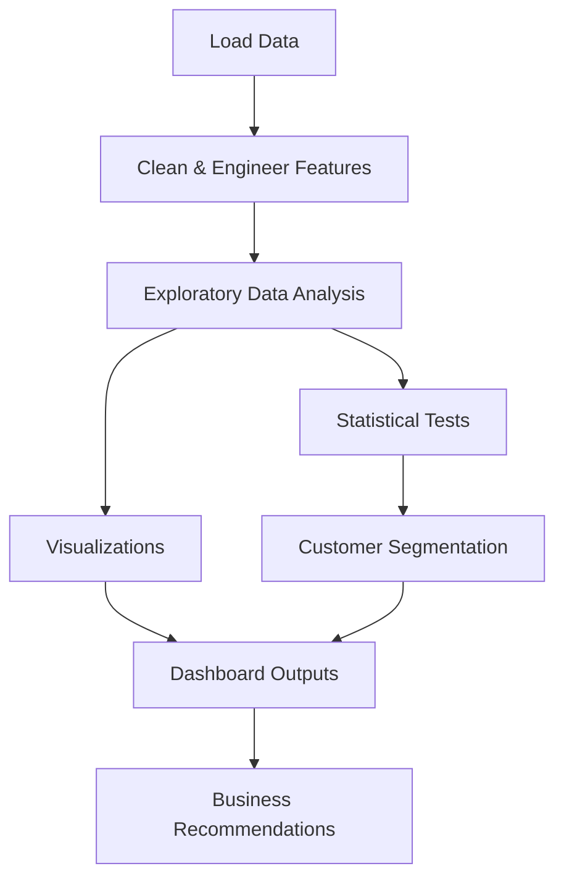
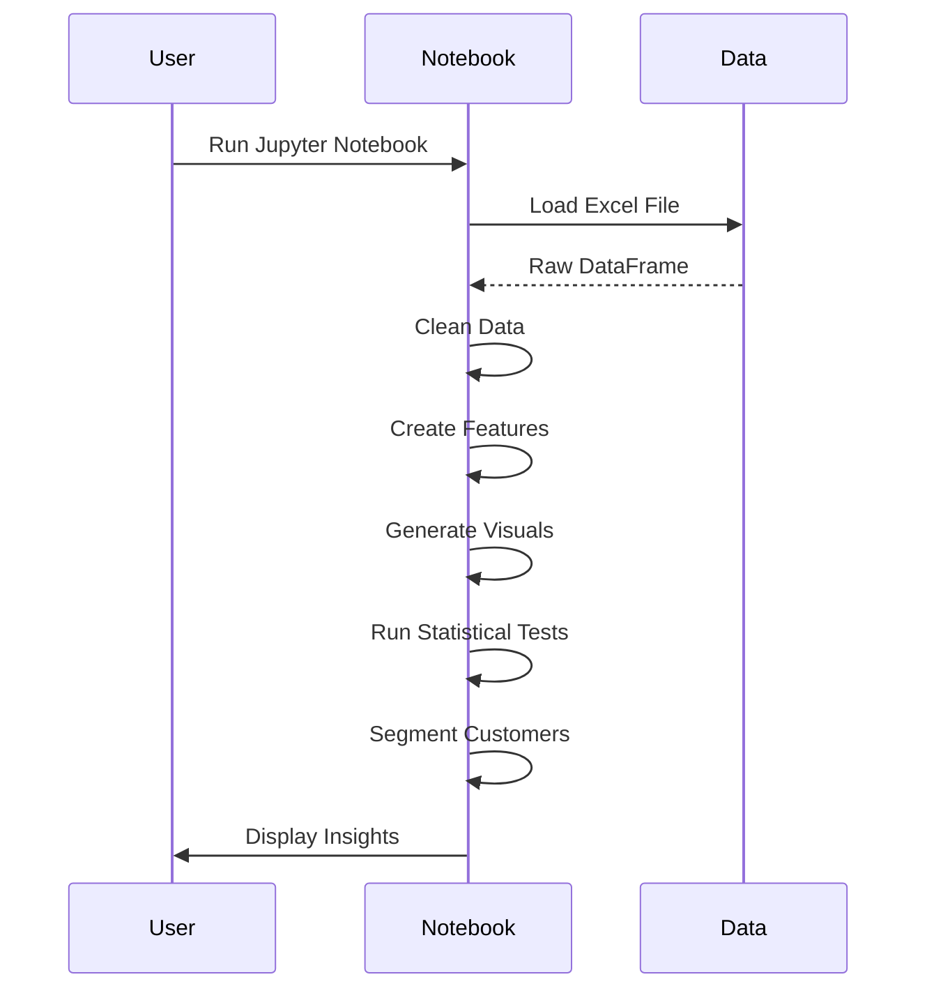

---

# E-commerce Customer Behavior Analysis

[](https://www.python.org/)
[](https://jupyter.org/)
[](https://github.com/Rakshak-D/ecommerce-customer-behaviour-analysis/issues)
[](LICENSE)

A comprehensive data science project analyzing e-commerce customer behavior to uncover spending patterns, segment customers, and provide actionable marketing recommendations.


---

## ✨ Key Features

### 📊 Data Analysis
- Summary statistics for customer metrics (e.g., Total Spend, Items Purchased)
- Correlation analysis to identify relationships between variables
- Statistical tests (Pearson, Chi-Square, ANOVA) for robust insights

### 📈 Visualizations
- Histograms of Total Spend and Spend per Item distributions
- Boxplots comparing spending across Membership Types
- Countplots for Churn Risk and Satisfaction Levels
- Cluster scatter plots for customer segmentation

### 🧠 Customer Segmentation
- KMeans clustering to group customers by behavior
- PCA for 2D visualization of clusters
- Elbow method to determine optimal cluster count

### 💡 Feature Engineering
- Derived features like Spend per Item, Churn Risk, and High Value Customer
- Age group categorization for demographic analysis
- Binary flags for Frequent and Recent Buyers

### 📝 Recommendations
- Targeted marketing strategies based on customer segments
- Retention campaigns for churn-risk customers
- Loyalty programs for high-value customers

---

## 🚀 Quick Start

### Prerequisites
- Python 3.9+
- Jupyter Notebook
- Excel file: `E-commerce Customer Behavior.xlsx`

### Setup Instructions
```bash
# Clone repository
git clone https://github.com/Rakshak-D/ecommerce-customer-behaviour-analysis.git
cd ecommerce-customer-behaviour-analysis

# Set up virtual environment
python -m venv .venv
source .venv/bin/activate  # Linux/Mac
.venv\Scripts\activate     # Windows

# Install dependencies
pip install -r requirements.txt

# Launch Jupyter Notebook
jupyter notebook
```

**Run Analysis:**
- Open `E-commerce_Customer_Analysis.ipynb` in Jupyter Notebook.
- Execute cells sequentially to load data, generate visualizations, and view recommendations.

**Dataset:**
- Place `E-commerce Customer Behavior.xlsx` in the project root.
- Expected columns: Customer ID, Gender, Age, City, Membership Type, Total Spend, Items Purchased, Average Rating, Days Since Last Purchase, Satisfaction Level, Discount Applied.

---

## 🌐 Project Overview

### Workflow Diagram


### Data Processing Flow


---

## 🛠 Technology Stack

| Component       | Technologies                                |
|-----------------|--------------------------------------------|
| **Programming** | Python 3.9+                                |
| **Notebook**    | Jupyter Notebook                           |
| **Data Analysis**| Pandas, NumPy, SciPy                       |
| **Visualization**| Matplotlib, Seaborn                        |
| **Machine Learning**| Scikit-learn (KMeans, PCA, StandardScaler) |
| **File Handling**| OpenPyXL                                   |

---

## 📂 Repository Structure

```
ecommerce-customer-behaviour-analysis/
├── ecommerce-customer-behaviour-analysis.ipynb  # Main analysis notebook
├── E-commerce Customer Behavior.xlsx            # Dataset 
├── E-commerce Customer Behavior.csv             # Dataset 
├── requirements.txt                             # Python dependencies
├── README.md                                    # Project documentation
├── LICENSE                                      # MIT License
└── .gitignore                                   # Git ignore file
```

---

## 📝 Core Dependencies

```text
# Base Requirements
pandas==2.2.1
numpy==1.26.4
matplotlib==3.8.3
seaborn==0.13.2
scikit-learn==1.4.1
scipy==1.12.0
openpyxl==3.1.2
jupyter==1.0.0
```

Install via:
```bash
pip install -r requirements.txt
```

---

## 🐛 Issue Reporting

[](https://github.com/Rakshak-D/ecommerce-customer-behaviour-analysis/issues)

**Bug Report Template:**
```markdown
## Description
[Describe the issue clearly]

## Reproduction Steps
1. Open notebook...
2. Run cell...
3. Observe...

**Expected Behavior**
[What should happen]

**Actual Behavior**
[What actually happens]

**Environment**
- OS: [e.g., Windows 11]
- Python Version: [e.g., 3.9.5]
- Jupyter Version: [e.g., 1.0.0]

**Additional Context**
[Screenshots, error logs]
```

**Issue Labels**
- `bug` - Code or output errors
- `enhancement` - New feature requests
- `documentation` - README or comment improvements

---

## 📜 License

This project is licensed under the MIT License - see [LICENSE](LICENSE) for details.

---

## 📬 Contact & Support

**Project Maintainer**  
Rakshak D  
📧 rakshakmce@gmail.com  
🔗 [GitHub Profile](https://github.com/Rakshak-D)

---

## 🛠️ Development Roadmap

### Next Milestones
- Add interactive Plotly dashboard
- Implement predictive modeling for churn
- Support for time-series analysis
- Automated report generation (PDF)

### Contribution Guide
1. Fork the repository.
2. Create a feature branch (`git checkout -b feature/new-analysis`).
3. Commit changes (`git commit -m 'Add new analysis feature'`).
4. Push to branch (`git push origin feature/new-analysis`).
5. Open a Pull Request.

**Code Standards**
- Follow PEP8 guidelines.
- Include clear cell comments.
- Ensure reproducibility with fixed random seeds.
- Update `requirements.txt` for new dependencies.

---

